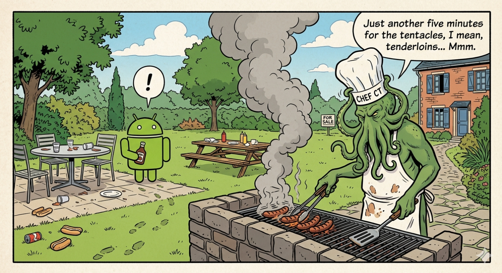

# DogeClock

A floating desktop clock widget built with Kotlin Multiplatform and Compose Desktop. A rewrite of a perfectly functional PowerShell script — because it had to be done.

Check out the companion blog post for this repo [here](https://www.costafotiadis.com/at-the-mountains-of-madness-rewriting-a-100-line-powershell-script-as-a-kmp-desktop-app/)

## Features

- Transparent, undecorated, always-on-top window
- Draggable — position is saved and restored between sessions
- System tray icon with show/hide and exit

## Install

Download the latest release from the [Releases](https://github.com/CostaFot/KMPClock/releases) page.

- **Windows** — run `DogeClock-Setup.exe`
- **Linux** — install the `.deb` package

## Build and Run

```shell
# macOS / Linux
./gradlew :composeApp:run

# Windows
.\gradlew.bat :composeApp:run
```

Requires JDK 17+.

## Releases

Releases are published via GitHub Actions. The workflow builds in parallel:

- **Windows** — Inno Setup installer (`DogeClock-Setup.exe`)
- **Linux** — `.deb` package

Triggered manually. Tagged as `v1.0.<commit_count>`.

To publish a release, go to **Actions → Publish Release → Run workflow**.
